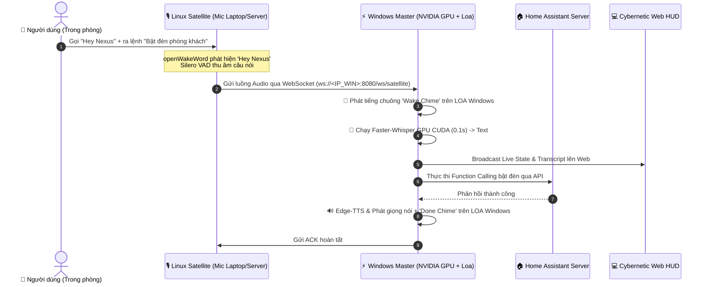

# 🤖 N.E.X.U.S. SMART HOME INTELLIGENCE SYSTEM

<p align="center">
  
  
  
  
  
  
  
</p>

> **NEXUS Smart Home System** hỗ trợ **Mô hình phân tán (Distributed Master - Satellite)**:
> - **Server / Laptop Linux (Satellite)**: Đặt trong phòng, sử dụng Microphone thu âm và bắt từ khóa *"Hey Nexus"* bằng `openWakeWord` siêu nhẹ.
> - **Máy tính Windows (Master)**: Đặt tại bàn làm việc/phòng máy, tận dụng card đồ họa **NVIDIA GPU (CUDA)** chạy `Faster-Whisper` STT và `Local LLM Ollama / Gemini`, kết nối trực tiếp với **Loa (Speaker)** để phát giọng nói Nexus trả lời và phát chuông âm thanh.

---

## 🏗️ Sơ Đồ Kiến Trúc Phân Tán (Master - Satellite)



---

## 🌟 Tính Năng Nổi Bật

1. 📡 **Kiến Trúc Phân Tán (Distributed Voice Satellite)**:
   - Cho phép đặt Laptop/Server Linux ở bất kỳ đâu trong nhà làm trạm thu âm Mic.
   - Toàn bộ tác vụ nặng (AI LLM, Whisper STT) và phát âm thanh dồn về máy Windows có GPU và Loa.
   - Tự động kết nối lại (Auto-reconnect) khi mạng LAN bị ngắt quãng.

2. ⚡ **Tối Ưu Sức Mạnh Card Đồ Họa NVIDIA GPU (CUDA)**:
   - **STT siêu tốc**: `Faster-Whisper` chạy `CUDA float16`, chuyển giọng nói thành văn bản chỉ trong **0.1 - 0.2 giây**!
   - **Local AI siêu tốc**: Chạy `Ollama` với model `Qwen2.5:1.5b` hoặc `Qwen2.5:3b` trên VRAM card đồ họa với tốc độ **>100 tokens/giây**, phản hồi tức thì và hoàn toàn Offline 100%.

3. 🎙️ **Voice Pipeline Kép**:
   - **Wake Word**: `openWakeWord` ("Hey Nexus" / "Nexus") siêu nhẹ.
   - **VAD**: `Silero VAD` tự động ngắt câu chính xác khi dứt lời.
   - **TTS**: `Edge-TTS` với giọng `vi-VN-NamMinhNeural` (giọng nam ấm, đĩnh đạc phong cách trợ lý Nexus).

4. 🏠 **Tích Hợp Sâu Home Assistant & Webhook**:
   - Tự động đồng bộ danh sách thiết bị qua **Long-Lived Access Token**.
   - Hỗ trợ: Đèn (`light`), Công tắc (`switch`), Điều hòa (`climate`), Quạt (`fan`), Rèm (`cover`), Cảm biến (`sensor`), Kịch bản (`scene` / `script` / `automation`).
   - Bắn webhook tùy biến mở rộng ra các hệ thống bên ngoài (n8n, IFTTT, Telegram bot,...).

5. 💻 **Giao Diện Web Cybernetic HUD (Port 8080)**:
   - Visualizer sóng âm Arc Reactor phản hồi theo âm thanh micro.
   - Live stream lịch sử hội thoại và các tool call thời gian thực qua WebSocket.

---

## 🚀 Hướng Dẫn Cài Đặt & Chạy Hệ Thống

### 🖥️ PHẦN A: Cài đặt Máy Chủ Trung Tâm (Windows Master + GPU + Loa)

#### 1. Cài đặt trên Windows bằng `uv`:
```powershell
# Chạy script cài đặt tự động 1-click:
.\scripts\install_windows.ps1
```

#### 2. Cấu hình file `.env` trên Windows:
```env
# Kết nối Home Assistant
HA_URL=http://192.168.1.x:8123
HA_TOKEN=eyJhbGciOi...

# AI Engine: 'ollama' (Local GPU) hoặc 'gemini' (Cloud)
LLM_PROVIDER=ollama
OLLAMA_MODEL=qwen2.5:1.5b

# Nếu dùng Gemini:
GEMINI_API_KEY=AIzaSy...
GEMINI_MODEL=gemini-1.5-flash
```

#### 3. Khởi động Windows Master:
Double click vào file **`start_nexus.bat`** (hoặc chạy trong PowerShell):
```powershell
.\start_nexus.bat
```
👉 Giao diện Web: `http://localhost:8080` (hoặc `http://<IP_MAY_WIN>:8080`).

---

### 🎙️ PHẦN B: Cài đặt Vệ Tinh Thu Âm (Linux Laptop / Server Mic)

#### 1. Cài đặt trên Linux:
```bash
git clone https://github.com/anhduyalpha/Nexus.git ~/Nexus
cd ~/Nexus
chmod +x scripts/install_ubuntu.sh scripts/start_satellite.sh
./scripts/install_ubuntu.sh
```

#### 2. Khởi động Satellite kết nối về máy Windows:
*(Thay `192.168.1.100` bằng địa chỉ IP máy Windows của bạn)*:
```bash
./scripts/start_satellite.sh ws://192.168.1.100:8080/ws/satellite
```

#### 3. Chạy ngầm vĩnh viễn cùng hệ điều hành Linux (Systemd Service):
```bash
# 1. Chỉnh sửa IP máy Windows trong file service
sudo nano service/nexus-satellite.service

# 2. Copy vào systemd và kích hoạt
sudo cp service/nexus-satellite.service /etc/systemd/system/
sudo systemctl daemon-reload
sudo systemctl enable --now nexus-satellite

# Xem log vệ tinh
sudo journalctl -u nexus-satellite -f
```

---

## 🗣️ Mẫu Câu Lệnh Giọng Nói Trực Tiếp Với Nexus

Chỉ cần đứng trước Microphone máy Linux nói **"Hey Nexus"**, nghe tiếng *Beep* phát ra từ **LOA máy Windows**, sau đó ra lệnh:

- 💡 **Điều khiển đèn**:
  - *"Bật đèn phòng khách"*
  - *"Tắt hết đèn trong nhà"*
  - *"Chỉnh đèn ngủ sang màu vàng ấm độ sáng 50%"*
- ❄️ **Điều hòa & Nhiệt độ**:
  - *"Nhiệt độ phòng ngủ hiện tại là bao nhiêu?"*
  - *"Bật điều hòa phòng ngủ lên 25 độ"*
- 🎬 **Kịch bản / Scenes**:
  - *"Kích hoạt chế độ xem phim"*
  - *"Tôi đi ngủ đây"*
- 🚀 **Bắn Webhook & Điều khiển ngoài**:
  - *"Gửi thông báo tới Telegram báo cáo hệ thống"*
  - *"Bắn webhook kích hoạt quy trình n8n"*
- 🎵 **Âm nhạc & Media**:
  - *"Phát nhạc thư giãn"*
  - *"Tăng âm lượng lên 80%"*
