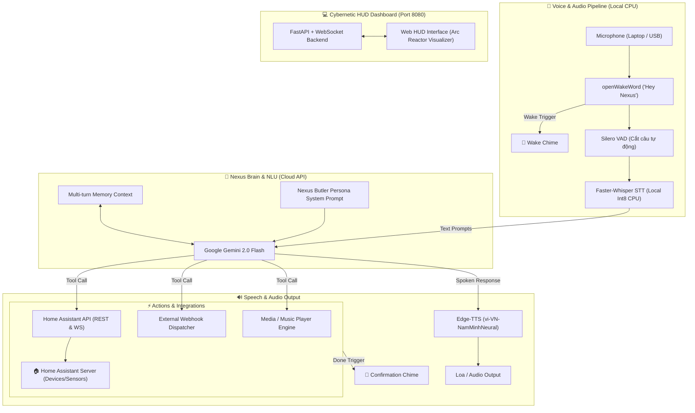

# 🤖 N.E.X.U.S. SMART HOME INTELLIGENCE SYSTEM

<p align="center">
  
  
  
  
  
  
</p>

> **Hệ thống Trợ lý giọng nói Nhà thông minh AI phong cách NEXUS hoạt động trên Ubuntu Linux Server (hoặc Laptop cũ)**, tích hợp trực tiếp **Home Assistant (REST & WebSocket API)**, hỗ trợ bắn **Webhook tùy biến**, nhận diện giọng nói **Local CPU (openWakeWord + Silero VAD + Faster-Whisper)**, suy luận thông minh bằng **Gemini 2.0 Flash (Function Calling)**, giọng đọc tự nhiên **Microsoft Edge-TTS**, và sở hữu giao diện **Web Cybernetic HUD** thời gian thực.

---

## 🏗️ Sơ Đồ Kiến Trúc Hệ Thống (Architecture)



---

## 🌟 Tính Năng Nổi Bật

1. 🎙️ **Voice Pipeline Hybrid Tối Ưu Cho Laptop Cũ / Server Linux**:
   - **Wake Word**: `openWakeWord` ("Hey Nexus" / "Nexus") nhận diện siêu nhẹ trên CPU.
   - **VAD (Voice Activity Detection)**: `Silero VAD` tự động ngắt câu chính xác khi người dùng dứt lời.
   - **STT (Speech-to-Text)**: `Faster-Whisper` (Local int8 quantized) nhận diện Tiếng Việt cực chuẩn, không tốn chi phí API.
   - **TTS (Text-to-Speech)**: `Edge-TTS` với giọng `vi-VN-NamMinhNeural` (giọng nam ấm, đĩnh đạc phong cách trợ lý Nexus).
   - **Âm thanh hiệu ứng**: Tự động phát âm thanh chuông sci-fi Nexus khi phát hiện Wake Word và khi thực thi lệnh xong.

2. 🧠 **Bộ Não AI Gemini 2.0 Flash & Function Calling**:
   - Tự động hiểu ngữ cảnh đa lượt (Multi-turn memory).
   - Tự động ánh xạ câu nói tự nhiên sang thiết bị trong Home Assistant mà không cần cấu hình mẫu câu cứng nhắc.
   - Trả lời thông minh, phong thái lịch thiệp chuẩn AI quản gia ("Thưa ngài / Sir").

3. 🏠 **Tích Hợp Sâu Home Assistant & Webhook**:
   - Đồng bộ danh sách thiết bị tự động qua **Long-Lived Access Token**.
   - Hỗ trợ: Đèn (`light`), Công tắc (`switch`), Điều hòa (`climate`), Quạt (`fan`), Rèm (`cover`), Cảm biến (`sensor`), Kịch bản (`scene` / `script` / `automation`).
   - Bắn webhook tùy biến mở rộng ra các hệ thống bên ngoài (n8n, IFTTT, Telegram bot,...).
   - Điều khiển Media Player / phát nhạc.

4. 💻 **Giao Diện Web Cybernetic HUD (Port 8080)**:
   - Visualizer sóng âm Arc Reactor phản hồi theo âm thanh micro.
   - Live stream lịch sử hội thoại và các tool call thời gian thực qua WebSocket.
   - Bật/tắt thiết bị nhanh trên Web.
   - Bảng test Webhook và cài đặt API Key trực tiếp trên trình duyệt.

---

## 📂 Cấu Trúc Thư Mục Dự Án

```text
Nexus/
├── core/                           # Voice & AI Engine
│   ├── audio_recorder.py          # Thu âm mic & Silero VAD ngắt câu tự động
│   ├── brain.py                   # Gemini 2.0 Flash + Nexus Persona + Function Calling
│   ├── orchestrator.py            # Vòng lặp điều phối toàn bộ hệ thống
│   ├── sound_effects.py           # Bộ phát âm thanh hiệu ứng Nexus (Chimes)
│   ├── stt.py                     # Faster-Whisper Local STT (int8 CPU)
│   ├── tts.py                     # Microsoft Edge-TTS (giọng Nam Minh)
│   └── wake_word.py               # openWakeWord phát hiện "Hey Nexus"
├── integrations/                   # Bộ kết nối mở rộng
│   ├── ha_client.py               # Home Assistant REST & WebSocket Client
│   ├── media_controller.py        # Điều khiển phát nhạc / media player
│   └── webhook_client.py          # Bắn Webhook tùy biến (IFTTT, n8n, Automation)
├── scripts/
│   ├── generate_chimes.py         # Script tự sinh âm thanh hiệu ứng WAV Sci-Fi
│   └── install_ubuntu.sh          # Script cài đặt tự động 1-click trên Ubuntu Linux
├── service/
│   └── nexus.service              # File cấu hình Systemd tự khởi động cùng OS
├── web/                            # Giao diện Cybernetic HUD Dashboard
│   ├── app.py                     # FastAPI backend + WebSocket live log
│   ├── static/
│   │   ├── css/nexus_hud.css      # Theme phong cách Arc Reactor Cybernetic
│   │   ├── js/nexus_hud.js        # Live audio visualizer & device controls
│   │   └── sounds/*.wav           # Bộ âm thanh Nexus Chimes
│   └── templates/index.html       # Web UI trực quan
├── .env.example                   # Mẫu cấu hình HA Token & Gemini API Key
├── .gitignore                     # Cấu hình bỏ qua venv, env và cache
├── config.py                      # Quản lý cấu hình toàn hệ thống
├── main.py                        # Entrypoint khởi động Nexus + Web Server
├── README.md                      # Tài liệu hướng dẫn chi tiết
└── requirements.txt               # Danh sách thư viện Python
```

---

## 🚀 Hướng Dẫn Cài Đặt & Khởi Chạy

### 1. Cài đặt trên máy cá nhân / Windows (dùng `uv`):

```powershell
# Tạo môi trường ảo Python 3.12
uv venv --python 3.12 .venv

# Kích hoạt môi trường
.venv\Scripts\Activate.ps1

# Cài đặt thư viện
uv pip install -r requirements.txt

# Tạo file .env và cấu hình API Key
copy .env.example .env
```

### 2. Cài đặt trên Ubuntu Linux Server (Laptop cũ):

```bash
# Clone hoặc copy dự án về server
git clone https://github.com/anhduyalpha/Nexus.git /opt/nexus
cd /opt/nexus

# Chạy script cài đặt tự động
chmod +x scripts/install_ubuntu.sh
./scripts/install_ubuntu.sh

# Cấu hình biến môi trường
nano .env
```

---

## 🔑 Hướng Dẫn Lấy Home Assistant Token & Gemini Key

### 1. Lấy Long-Lived Access Token trong Home Assistant:
1. Mở giao diện Home Assistant trên trình duyệt.
2. Bấm vào **Tài khoản người dùng (Profile)** ở góc dưới cùng bên trái.
3. Kéo xuống dưới cùng tại mục **Long-Lived Access Tokens** (Mã truy cập dài hạn).
4. Bấm **Create Token** (Tạo mã), đặt tên là `Nexus`, sao chép đoạn mã hiển thị và dán vào `HA_TOKEN` trong `.env`.

### 2. Lấy Google Gemini API Key:
1. Truy cập [Google AI Studio](https://aistudio.google.com/).
2. Bấm **Get API Key** $\rightarrow$ **Create API Key**.
3. Sao chép API Key và dán vào `GEMINI_API_KEY` trong `.env`.

---

## 🎮 Khởi Chạy Hệ Thống

### Khởi chạy thủ công:
```bash
python main.py
```
Hoặc chế độ Web-only (không dùng mic vật lý):
```bash
python main.py --no-voice
```

Truy cập giao diện Web Dashboard tại:
👉 `http://<IP_SERVER_LINUX>:8080` (Ví dụ: `http://localhost:8080` hoặc `http://192.168.1.50:8080`)

### Chạy ngầm vĩnh viễn cùng hệ thống (Systemd Service trên Linux):
```bash
# 1. Chỉnh sửa file service cho đúng đường dẫn và username
sudo nano service/nexus.service

# 2. Copy vào thư mục systemd
sudo cp service/nexus.service /etc/systemd/system/

# 3. Reload và kích hoạt service
sudo systemctl daemon-reload
sudo systemctl enable --now nexus

# 4. Kiểm tra trạng thái log của Nexus
sudo systemctl status nexus
sudo journalctl -u nexus -f
```

---

## 🗣️ Các Mẫu Câu Lệnh Giọng Nói Mẫu

Chỉ cần nói **"Hey Nexus"** hoặc **"Nexus"**, nghe tiếng *Beep*, sau đó ra lệnh:

- 💡 **Điều khiển đèn**:
  - *"Bật đèn phòng khách"*
  - *"Tắt hết đèn trong nhà"*
  - *"Chỉnh đèn ngủ sang màu vàng ấm độ sáng 50%"*
- ❄️ **Điều hòa & Nhiệt độ**:
  - *"Nhiệt độ phòng ngủ hiện tại là bao nhiêu?"*
  - *"Bật điều hòa phòng ngủ lên 25 độ"*
- 🎬 **Kịch bản / Scenes**:
  - *"Kích hoạt chế độ xem phim"*
  - *"Tôi đi ngủ đây"* (Nexus sẽ tự tắt hết thiết bị được gán trong script HA)
- 🚀 **Bắn Webhook & Điều khiển ngoài**:
  - *"Gửi thông báo tới Telegram báo cáo hệ thống"*
  - *"Bắn webhook kích hoạt quy trình n8n sao lưu dữ liệu"*
- 🎵 **Âm nhạc & Media**:
  - *"Phát nhạc thư giãn"*
  - *"Tăng âm lượng lên 80%"*
  - *"Tạm dừng nhạc"*
