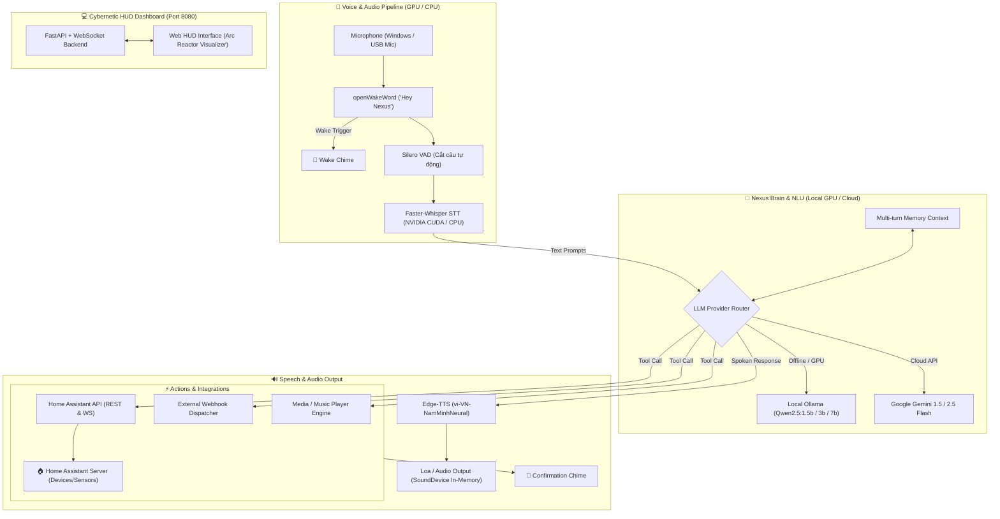

# 🤖 N.E.X.U.S. SMART HOME INTELLIGENCE SYSTEM

<p align="center">
  
  
  
  
  
  
  
</p>

> **Hệ thống Trợ lý giọng nói Nhà thông minh AI phong cách NEXUS hoạt động tối ưu trên Windows (tận dụng sức mạnh Card đồ họa NVIDIA GPU / CUDA)** & Linux Server, tích hợp trực tiếp **Home Assistant (REST & WebSocket API)**, hỗ trợ bắn **Webhook tùy biến**, nhận diện giọng nói **Faster-Whisper (GPU CUDA / CPU)**, suy luận thông minh bằng **Local LLM Ollama (Qwen2.5:1.5b / 3b / 7b) hoặc Gemini 1.5/2.5 Flash**, giọng đọc tự nhiên **Microsoft Edge-TTS**, và sở hữu giao diện **Web Cybernetic HUD** thời gian thực.

---

## 🏗️ Sơ Đồ Kiến Trúc Hệ Thống (Architecture)



---

## 🌟 Tính Năng Nổi Bật

1. ⚡ **Tối Ưu Card Đồ Họa NVIDIA GPU / CUDA Trên Windows**:
   - **STT siêu tốc**: `Faster-Whisper` tự động phát hiện GPU NVIDIA và chạy chế độ `CUDA float16`, chuyển giọng nói thành chữ chỉ trong **0.1 - 0.2 giây**!
   - **Local AI siêu tốc**: Chạy `Ollama` với model `Qwen2.5:1.5b` hoặc `Qwen2.5:3b` trên VRAM card đồ họa với tốc độ **>100 tokens/giây**, phản hồi tức thì và hoàn toàn Offline 100%.

2. 🎙️ **Voice Pipeline Thông Minh & Nhẹ Nhàng**:
   - **Wake Word**: `openWakeWord` ("Hey Nexus" / "Nexus") chạy nền liên tục không hao tốn tài nguyên.
   - **VAD**: `Silero VAD` tự động ngắt câu chính xác khi người dùng dứt lời.
   - **TTS**: `Edge-TTS` với giọng `vi-VN-NamMinhNeural` (giọng nam ấm, đĩnh đạc phong cách trợ lý Nexus).
   - **Âm thanh hiệu ứng**: Tự động phát âm thanh chuông sci-fi Nexus qua `sounddevice` trực tiếp trong bộ nhớ.

3. 🧠 **Bộ Não AI Kép (Local Ollama & Cloud Gemini)**:
   - Dễ dàng chuyển đổi giữa **Local Offline (Ollama)** và **Cloud (Gemini)** ngay trên giao diện Web Dashboard.
   - Tự động hiểu ngữ cảnh đa lượt (Multi-turn memory) và tự động ánh xạ câu nói tự nhiên sang thiết bị trong Home Assistant.

4. 🏠 **Tích Hợp Sâu Home Assistant & Webhook**:
   - Tự động đồng bộ danh sách thiết bị qua **Long-Lived Access Token**.
   - Hỗ trợ: Đèn (`light`), Công tắc (`switch`), Điều hòa (`climate`), Quạt (`fan`), Rèm (`cover`), Cảm biến (`sensor`), Kịch bản (`scene` / `script` / `automation`).
   - Bắn webhook tùy biến mở rộng ra các hệ thống bên ngoài (n8n, IFTTT, Telegram bot,...).

5. 💻 **Giao Diện Web Cybernetic HUD (Port 8080)**:
   - Visualizer sóng âm Arc Reactor phản hồi theo âm thanh micro.
   - Live stream lịch sử hội thoại và các tool call thời gian thực qua WebSocket.
   - Bật/tắt thiết bị nhanh trên Web và bảng cài đặt API Key trực tiếp.

---

## 🚀 Hướng Dẫn Cài Đặt & Khởi Chạy Trên Windows (GPU)

### 1. Cài đặt nhanh bằng `uv`:
```powershell
# Chạy script cài đặt tự động 1-click cho Windows:
.\scripts\install_windows.ps1
```

Hoặc cài thủ công:
```powershell
# Tạo môi trường ảo Python 3.12
uv venv --python 3.12 .venv

# Cài đặt thư viện
uv pip install -r requirements.txt
uv pip install --no-deps "openwakeword>=0.6.0"

# Tạo file âm thanh chuông
.venv\Scripts\python.exe scripts\generate_chimes.py
```

### 2. Cấu hình file `.env`:
Mở file `.env` và điền thông tin:
```env
# Kết nối Home Assistant
HA_URL=http://192.168.1.x:8123
HA_TOKEN=eyJhbGciOi...

# Chọn Engine AI: 'ollama' (Local GPU) hoặc 'gemini' (Cloud)
LLM_PROVIDER=ollama
OLLAMA_MODEL=qwen2.5:1.5b

# Nếu dùng Gemini:
GEMINI_API_KEY=AIzaSy...
GEMINI_MODEL=gemini-1.5-flash
```

### 3. (Tùy chọn) Cài Ollama chạy Local trên Windows:
1. Tải và cài đặt [Ollama cho Windows](https://ollama.com/download/windows) (Tự động nhận card đồ họa NVIDIA).
2. Mở terminal và tải model:
   ```cmd
   ollama run qwen2.5:1.5b
   ```
   *(Gõ `/bye` sau khi tải xong để thoát)*.

### 4. Khởi động Nexus:
Chỉ cần **double click vào file `start_nexus.bat`** (hoặc chạy trong PowerShell):
```powershell
.\start_nexus.bat
```

👉 Mở trình duyệt truy cập: **`http://localhost:8080`**

---

## 🗣️ Các Mẫu Câu Lệnh Giọng Nói Mẫu

Chỉ cần nói **"Hey Nexus"** hoặc **"Nexus"**, nghe tiếng *Beep*, sau đó ra lệnh:

- 💡 **Điều khiển đèn**:
  - *"Bật đèn phòng khách"*
  - *"Tắt hết đèn trong nhà"*
  - *"Chỉnh đèn ngủ sang màu vàng ấm độ sáng 50%"*
- ❄️ **Điều hòa & Nhiệt độ**:
  - *"Nhiệt độ phòng ngủ hiện tại là bao nhiêu?"*
  - *"Bật điều hòa phòng ngủ lên 25 độ"*
- 🎬 **Kịch bản / Scenes**:
  - *"Kích hoạt chế độ xem phim"*
  - *"Tôi đi ngủ đây"*
- 🚀 **Bắn Webhook & Điều khiển ngoài**:
  - *"Gửi thông báo tới Telegram báo cáo hệ thống"*
  - *"Bắn webhook kích hoạt quy trình n8n"*
- 🎵 **Âm nhạc & Media**:
  - *"Phát nhạc thư giãn"*
  - *"Tăng âm lượng lên 80%"*
